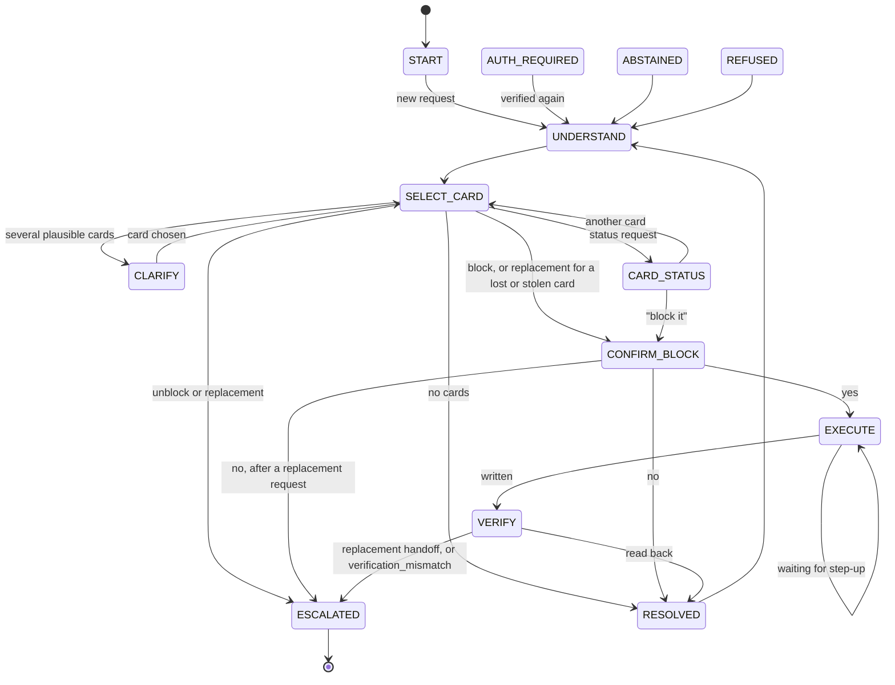
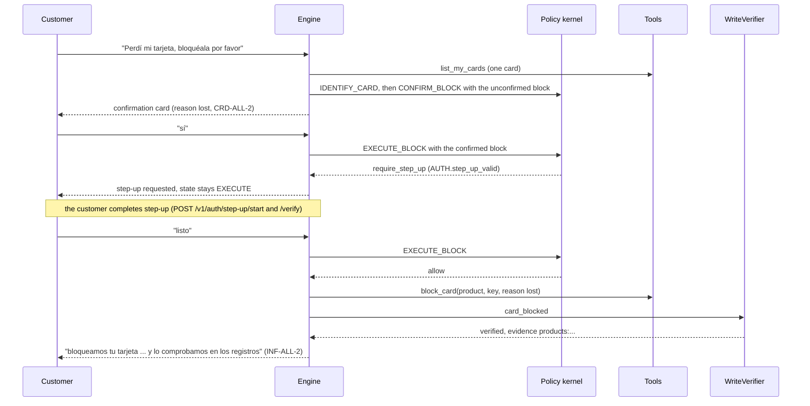
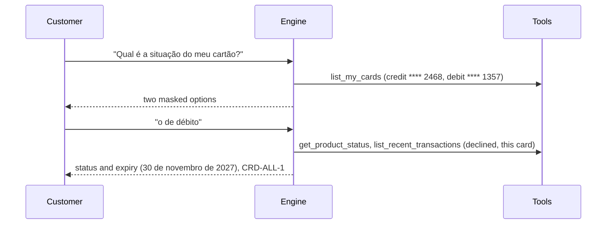
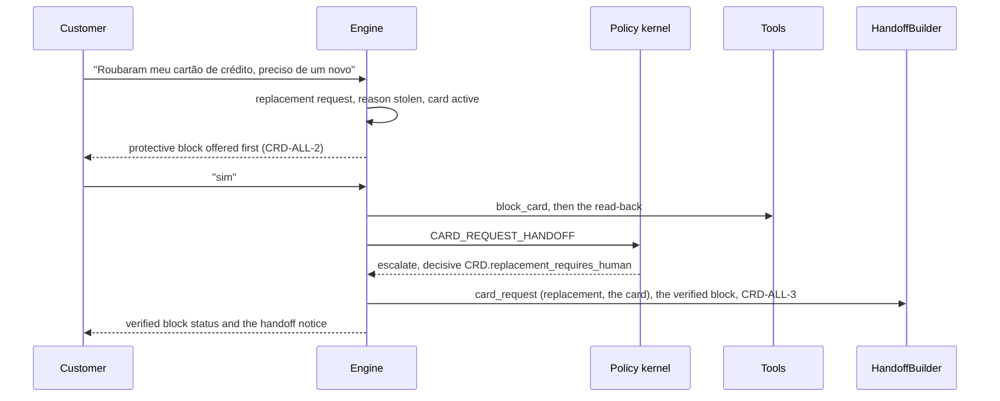

# Card support

The `card_support` workflow answers card status (with expiry and recent declined purchases), performs a protective card block with confirmation, step-up, and a verified read-back, and hands unblock and replacement requests to a person with a `card_request` section. Code: `services/api/src/bank_agent/application/workflows/card_support/`. It runs on the same engine, kernel, tools, and verifier as [dispute intake](dispute-intake.md).

## State machine

Shared exits (ESCALATED, ABSTAINED, REFUSED, AUTH_REQUIRED) apply to every non-terminal state. CARD_STATUS accepts new requests and keeps the chosen card for a follow-up such as "block it". A block request that explicitly names a card goes through SELECT_CARD again before confirmation. A request for another workflow is confirmed before switching (scenario 17). When the router cannot place a message in CARD_STATUS that names a card by type or ending ("e o de débito?", "¿y la terminada en 1357?"), the `follow_up` recognizer continues with a status request for that card (QA finding CRD-03). "The other one" and a bare four-digit number are not recognized yet.

## States, rules, clauses, tools, and exits

Common clauses as in [dispute intake](dispute-intake.md#states-rules-clauses-tools-and-exits).

| State | Binding | Ports | Rules beyond the common ones | Clauses beyond the common ones | Tools | Exits |
|---|---|---|---|---|---|---|
| START | START | none | `SCOPE.supported_intent` | SCOPE-ALL-2 | none | UNDERSTAND |
| AUTH_REQUIRED | START | none | AUTH rules at the resume state | SCOPE-ALL-2 | none | the resume state |
| UNDERSTAND | START | IntentRouter, LLM (`extract_card_support_slots`) | none | SCOPE-ALL-2 | none | SELECT_CARD |
| SELECT_CARD | IDENTIFY_CARD | none | `CRD.card_owned_by_session_customer`, `CRD.unblock_requires_human`, `CRD.replacement_requires_human` | CRD-ALL-1, CRD-ALL-3 | list_my_cards, get_product_status | CLARIFY, CARD_STATUS, CONFIRM_BLOCK, ESCALATED, RESOLVED |
| CLARIFY | IDENTIFY_CARD | none | as above | as above | as above | SELECT_CARD, CARD_STATUS, CONFIRM_BLOCK |
| CARD_STATUS | ANSWER_CARD_STATUS | none | `CRD.card_owned_by_session_customer` | CRD-ALL-1, CRD-ALL-3 | get_product_status, list_recent_transactions (declined only), list_my_cards | CONFIRM_BLOCK, SELECT_CARD, switch |
| CONFIRM_BLOCK | CONFIRM_BLOCK | none | `CRD.card_active`, `CRD.block_requires_step_up`, action rules | CRD-ALL-1, CRD-ALL-2 | list_my_cards, get_product_status | EXECUTE, RESOLVED, ESCALATED |
| EXECUTE | EXECUTE_BLOCK | none | the rules above with the confirmed action, `AUTH.step_up_valid` | CRD-ALL-1, CRD-ALL-2, INF-ALL-2 | block_card | VERIFY, EXECUTE (step-up) |
| VERIFY | EXECUTE_BLOCK | WriteVerifier | `ESC.verification_mismatch` | as EXECUTE | none | RESOLVED, ESCALATED |
| RESOLVED, ABSTAINED, REFUSED | START | IntentRouter | common | SCOPE-ALL-2 | none | UNDERSTAND, switch |
| ESCALATED | ESCALATE (card requests evaluated in CARD_REQUEST_HANDOFF) | HandoffBuilder | common, CRD request rules | ESC-{c}-2, CRD-ALL-3 | none | terminal |

- SELECT_CARD reads only the session customer's cards (`list_my_cards`, added in this phase; status and expiry, never balances). A card ending or a type explicitly recognized in the customer's message narrows the choice; model-only card hints are ignored and ambiguous requests get masked options; a block prefers active cards. Options are shown masked (type and last four).
- CARD_STATUS never interprets `response_code`: the data has no code table, so declined purchases are listed with date, merchant, and amount and the statement that the records do not give the reason (`CRD-ALL-1`).
- New requests after RESOLVED, ABSTAINED, or REFUSED start with empty card-flow data. A new explicit card hint replaces both previous hint fields; conflicting type and ending hints show all owned cards for clarification.
- The block reason (`lost`, `stolen`, `unrecognized_activity`, `precaution`) is a tool argument on the audit allowlist, so it is visible in the audit event and the execution record.
- "I did not make this purchase" is a `dispute_new` intent: the router asks before switching and carries the chosen card into the dispute as a candidate filter.

## Sequence: normal path (scenario 14, es-CO lost card)

## Sequence: ambiguous path (scenario 13, pt-BR two cards)

## Sequence: escalation path (scenario 16, pt-BR stolen card replacement)

## Confirmation and abstention matrix

| Situation | Outcome | Basis |
|---|---|---|
| Block an active card | Yes at CONFIRM_BLOCK, step-up at EXECUTE, read-back before success, reason recorded | `CRD-ALL-2`, `policies/matrix.yaml` |
| Card already blocked | Abstain with the clause | `CRD.card_active` (`CRD-ALL-2`) |
| Card closed or suspended | Abstain (deny) with the clause | `CRD.card_active` |
| Unblock request | Escalate with `card_unblock_requested` and a `card_request` | `CRD-ALL-3` |
| Replacement request | Escalate with `card_replacement_requested`; a lost or stolen active card gets the block offer first | `CRD-ALL-3` |
| Several plausible cards | Masked options, then the answer | `CRD-ALL-1` |
| A state question that names the participle ("¿está bloqueada?", "ativo ou bloqueado?") | Card status, never a block confirmation | `CRD-ALL-1` |
| Another person's card | Refuse with a trust event | `PRV-ALL-2` |
| Customer declines the block | Nothing recorded (or the replacement handoff) | none |

## Tests

Scenarios 13 to 17 and follow-ups run on both backends (`services/api/tests/integration/workflows/test_card_and_routing.py`, `test_denials_and_follow_ups.py`). Selection regressions in `test_card_selection_evidence.py` cover invented model hints and explicit customer choices in es and pt on both backends. `test_card_block_follow_ups.py` covers selecting another card after a status answer, cancellation followed by a new request, and contradictory type and ending hints.

`services/api/tests/unit/application/workflows/test_qa_card_regressions.py` (production QA, 2026-10-05) covers a status follow-up that names no card (answered again for the same card), a block request after it, and a block request typed while choosing a card, which keeps the request and reason and chooses through the normal selection.

## Limitations

- Card selection uses the deterministic Spanish and Portuguese type and ending recognizers. Unrecognized phrasings require clarification even if the model proposes a card.
- There is no unblock or replacement tool by design; a person handles both.
- Declined purchases show no reason because the data has no response-code table.
- Step-up itself is an HTTP route (`/v1/auth/step-up/*`, [API](../api/README.md)); the engine only asks for it and re-checks the window at EXECUTE. After it the client sends the next message and the block runs. A new sign-in (a new session lineage) at EXECUTE goes back to CONFIRM_BLOCK and asks again.
