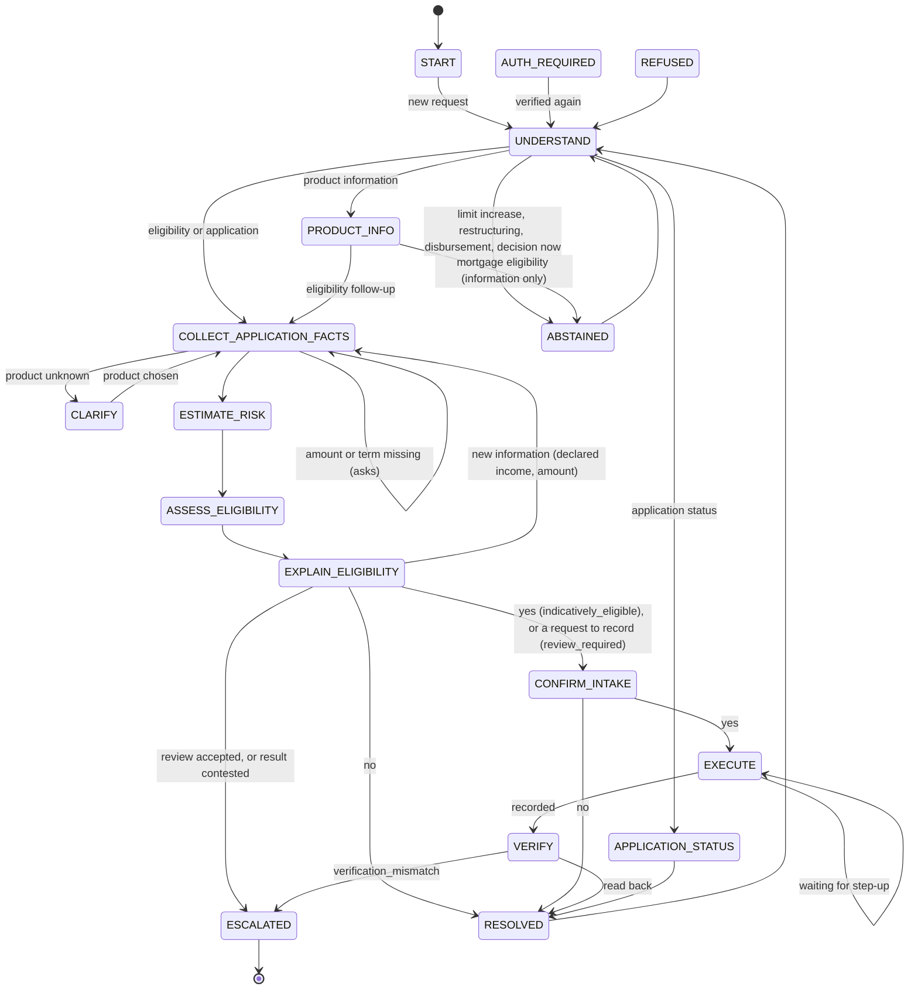
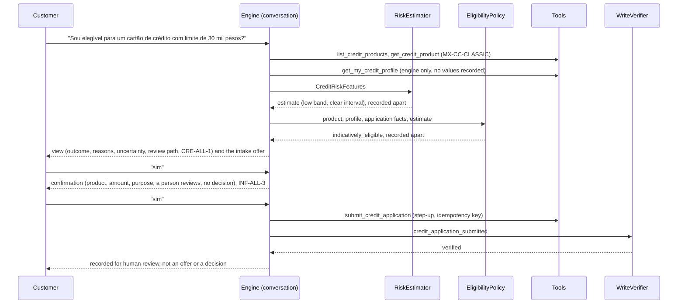
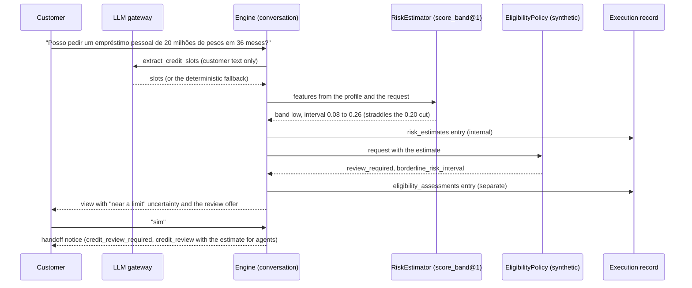
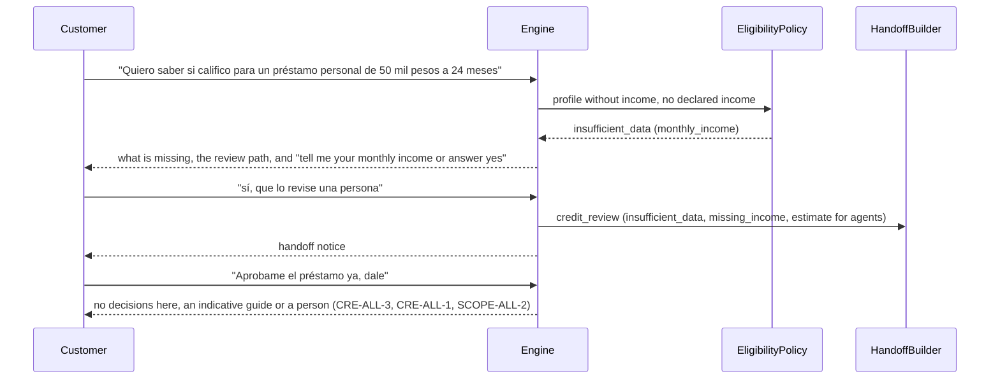

# Credit information and eligibility support

The `credit` workflow answers from the synthetic credit catalog, gives an indicative eligibility result from the synthetic eligibility service, and records an application intake for human review. It never makes a lending decision, never states or implies approval, and never moves money. Code: `services/api/src/bank_agent/application/workflows/credit/`. The separation of its three components is described in [credit separation](../architecture/credit-separation.md) and [ADR 0021](../adr/0021-credit-risk-and-eligibility-separation.md).

## State machine

Shared exits apply to every non-terminal state. ESTIMATE_RISK and ASSESS_ELIGIBILITY are working states: they run within the turn that collects the last fact and end in EXPLAIN_ELIGIBILITY.

## States, rules, clauses, tools, and exits

Common clauses on every state as in [account inquiry](account-inquiry.md#states-rules-clauses-tools-and-exits).

| State | Binding | Ports | Rules beyond the common ones | Clauses beyond the common ones | Tools | Exits |
|---|---|---|---|---|---|---|
| START, AUTH_REQUIRED | START | none | `SCOPE.supported_intent` | SCOPE-ALL-2 | none | UNDERSTAND, resume |
| UNDERSTAND | START | IntentRouter, LLM (`extract_credit_slots`, customer text only) | `SCOPE.supported_intent` (unsupported) | SCOPE-ALL-2, CRE-ALL-3 when abstaining | none | PRODUCT_INFO, COLLECT_APPLICATION_FACTS, APPLICATION_STATUS, ABSTAINED |
| PRODUCT_INFO | PRODUCT_DETAIL (LIST_PRODUCTS for the list) | none | `CRE.product_in_catalog`, `CRE.offered_in_jurisdiction`, `CRE.disclaimer_present` | CRE-ALL-1, CRE-ALL-2, CRE-{c}-1, CRE-ALL-3, ELG-ALL-3 (mortgages) | list_credit_products, get_credit_product | COLLECT_APPLICATION_FACTS, UNDERSTAND, ABSTAINED |
| CLARIFY | COLLECT_APPLICATION | none | clarification budget | CRE-ALL-1, CRE-ALL-2, ELG-ALL-1 | as above | PRODUCT_INFO, COLLECT_APPLICATION_FACTS |
| COLLECT_APPLICATION_FACTS | COLLECT_APPLICATION | none | CRE catalog rules, clarification budget | as CLARIFY | as above | ESTIMATE_RISK, CLARIFY, PRODUCT_INFO |
| ESTIMATE_RISK | COLLECT_APPLICATION | RiskEstimator; the engine-only profile read | none | as CLARIFY | none on the allowlist | ASSESS_ELIGIBILITY |
| ASSESS_ELIGIBILITY | PRESENT_ELIGIBILITY | EligibilityPolicy (ELG rules inside the service) | none | CRE-ALL-1, CRE-ALL-2, ELG-ALL-1..3, ELG-{c}-1.x, ESC-ALL-4 | as above | EXPLAIN_ELIGIBILITY |
| EXPLAIN_ELIGIBILITY | PRESENT_ELIGIBILITY | phase 06 renderer | `ESC.credit_review_required` (offered, not forced), `ESC.eligibility_contested` | as above | as above | CONFIRM_INTAKE, COLLECT_APPLICATION_FACTS, RESOLVED, ESCALATED |
| CONFIRM_INTAKE | CONFIRM_APPLICATION | none | CRE rules, action rules, step-up | CRE-ALL-1, CRE-ALL-2, INF-ALL-3 | as above | EXECUTE, RESOLVED |
| EXECUTE | SUBMIT_APPLICATION | none | action rules with `confirmed_at`, `AUTH.step_up_valid` | as CONFIRM_INTAKE | submit_credit_application | VERIFY, EXECUTE (step-up) |
| VERIFY | SUBMIT_APPLICATION | WriteVerifier | `ESC.verification_mismatch` | as above | none (read-back) | RESOLVED, ESCALATED |
| APPLICATION_STATUS | ANSWER_APPLICATION_STATUS | none | common | CRE-ALL-1, INF-ALL-3 | get_credit_application_status, list_my_credit_applications, list_credit_products | RESOLVED |
| RESOLVED, ABSTAINED, REFUSED | START | IntentRouter | common | SCOPE-ALL-2 | none | UNDERSTAND, switch |
| ESCALATED | ESCALATE | HandoffBuilder | common | ESC-{c}-2, ESC-ALL-4 | none | terminal |

- **Conversation.** UNDERSTAND and EXPLAIN_ELIGIBILITY see only the customer's message and the rendered view. The model proposes a product, an amount, a term, a purpose, and a declared income; amounts, terms, and income are normalized from the text first (`understanding/slots.py`), and the purpose maps to catalog codes (`general_purpose` otherwise, shown before anything is recorded). A credit card has no term: one month, the billing cycle, is recorded.
- **Risk estimate.** ESTIMATE_RISK reads the profile through the engine-only `get_my_credit_profile` (recorded with no values), builds `CreditRiskFeatures`, and calls the port. `RiskEstimatorUnavailableError` gives no estimate (never a default) and the safety intervention `risk_estimate_unavailable`.
- **Eligibility.** ASSESS_ELIGIBILITY calls the synthetic service with the catalog entry, the profile, the application facts, and the estimate or `None`. The estimate goes to `ExecutionRecord.risk_estimates` (internal) and the assessment to `eligibility_assessments`, as separate entries.
- **Explanation.** EXPLAIN_ELIGIBILITY renders `EligibilityView` (outcome, reasons with citations, uncertainty, review path, `CRE-ALL-1`) and adds the question its outcome allows. The verifier receives the assessment (an outcome claim must match it) and the profile, the estimate, and the declared income as figures that must never appear; phrasing, when on, receives only the outcome code, the rendered reasons, and the disclaimer.
- **Intake.** Only after an explanation and only for `indicatively_eligible` (yes) or `review_required` (an explicit request). The idempotency key derives from the conversation, the assessment, the product, and the action, so a resumed step never records twice. The intake records the assessment id (`assessment_ref`) and the originating conversation (`origin_conversation_id`), both set by the engine from its own state, so the agent's credit application view links to the assessment and the conversation.
- **Application status.** An `app-` id in the text (checked for ownership by the engine; another customer's id is refused) or an intake verified earlier in the conversation is answered with `get_credit_application_status`. Without either, `list_my_credit_applications` reads the session customer's intakes, newest first: one answers its status (`credit.application_status`); several list the newest three with id, product type, date, and status (`credit.application_statuses`), with no follow-up question because every listed status is already answered; none says there is no application on record and offers the catalog (`credit.status_none_on_record`).

## Sequence: normal path (scenario 25, pt-BR complete profile and intake)

## Sequence: conversation, risk estimate, and eligibility as separate participants (scenario 27, borderline)

## Sequence: ambiguous and unsupported paths (scenarios 26 and 28)

## Risk estimator baseline `risk_estimator:score_band@1`

`adapters/models/score_band_risk.py`: deterministic bands from the credit score only, with wide intervals, `calibrated: false`, and `label_definition: score_band_baseline_prior`. It is a baseline, not a trained model, and it stays the default. Session 10b registered the learned snapshot risk estimators behind the same port (`WORKFLOW_RISK_ESTIMATOR=logreg@champion` or `lgbm@...`); see [the model card](../models/risk-estimator.md). On test the score bands show no association with the snapshot delinquency label (ROC AUC 0.504), and the learned models reach 0.611, almost entirely through the credit product count.

| Score | Band | Probability | Interval | Effect in the synthetic service |
|---|---|---|---|---|
| 740 to 850 | low | 0.06 | 0.02 to 0.15 | clear |
| 680 to 739 | low | 0.15 | 0.08 to 0.26 | borderline (0.20 cut): review |
| 640 to 679 | medium | 0.27 | 0.22 to 0.33 | clear |
| 600 to 639 | medium | 0.33 | 0.25 to 0.42 | borderline (0.35 cut): review |
| 300 to 599 | high | 0.50 | 0.38 to 0.70 | clear, band not acceptable |
| missing | unknown (`missing_features`) | 0.50 | 0.00 to 1.00 | treated as no estimate |

## Confirmation and abstention matrix

| Situation | Outcome | Basis |
|---|---|---|
| Product information | Catalog answer with the disclaimer; no eligibility | `CRE-ALL-1`, `CRE-ALL-2`, `CRE-{c}-1` |
| `indicatively_eligible` | View, then an intake offer; yes at EXPLAIN and at CONFIRM_INTAKE, step-up at EXECUTE, read-back before success | `ELG-*`, `INF-ALL-3`, `policies/matrix.yaml` |
| `review_required` | View and a handoff offer (`credit_review_required`); an intake only on an explicit request | `ESC-ALL-4` |
| `insufficient_data` | View with what is missing; a declared income assesses again; yes hands off with `credit_review` | `ELG-ALL-1`, `ESC-ALL-4` |
| `not_eligible` | View and an offer of a person (`human_requested` with `credit_review`) | `ELG-{c}-1.x` |
| The customer contests any result | Handoff with `eligibility_contested` | `ESC.eligibility_contested` |
| Estimator unavailable | `review_required` with `risk_estimate_unavailable`; no estimate recorded | `ELG-ALL-2` |
| Mortgage eligibility | Information only: catalog figures, `ELG-ALL-3`, ask for a person | `CRE-ALL-2`, `ELG-ALL-3` |
| Limit increase, restructuring, disbursement | Abstain with an offer of a person | `CRE-ALL-3`, `SCOPE-ALL-2` |
| A decision now ("just approve it", "Aprove o meu crédito agora", "Aprueba mi crédito ya": an approval verb in the imperative or with an immediacy word; asking what approval needs is not one) | Abstain, disclaimer, and the review path; no approval wording | `CRE-ALL-3`, `CRE-ALL-1` |
| Distress or over-indebtedness | Escalate | `ESC.distress_signal` (`ESC-ALL-3`) |

## Tests

Scenarios 24 to 29 with variants run on both backends (`test_credit_workflow.py`, `test_credit_edges.py`); `test_credit_separation.py` drives every credit path with a recording `FakeLLM` (understanding, phrasing, and summaries on) and asserts that no prompt receives a profile or estimate value; `test_credit_properties.py` is the Hypothesis property over profile gaps and estimator outcomes; `test_credit_wording.py` scans every template for approval wording.

## Limitations

- The default estimator is a score-band baseline with no trained label; its intervals are wide by design and not calibrated. The learned estimators are cross-sectional and weak (ADR 0030), and with them every first-time applicant is out of distribution and goes to review.
- Income stays in the product currency (no exchange rates), so `monthly_income_usd` is unset for the estimator.
- Catalog names are shown as product types, not the catalog's display names (BACKLOG, phase 13).
