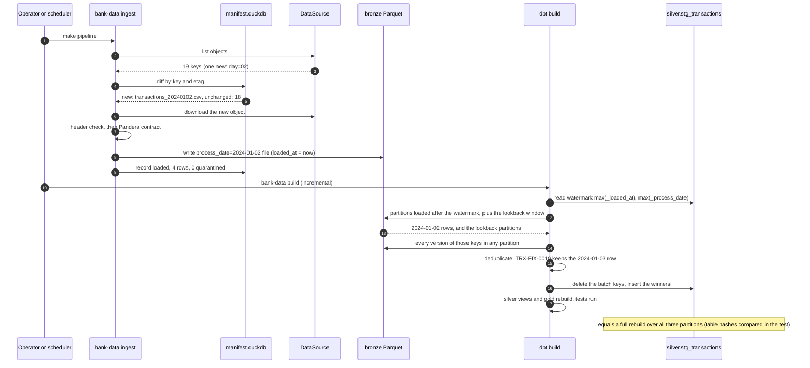

# Data pipeline

The path from the organizer bucket (or the committed sample) to the tables the API and the ML phases read. Commands are in [`data_platform/README.md`](../../data_platform/README.md); freshness, late arrivals, and schema evolution in the [update policy](../data/update-policy.md); the generated model graph in [lineage.md](../data/lineage.md).

## From source to serving

```mermaid
flowchart LR
    subgraph sources["Sources (one per warehouse)"]
        s3["Organizer S3 bucket<br/>7,671 CSV objects"]
        sample["Committed sample<br/>data_platform/sample"]
        fixture["Fixture<br/>data_platform/fixtures"]
    end
    subgraph ingest["bank-data ingest"]
        list["List objects<br/>DataSource port"]
        diff["Diff by key and etag<br/>manifest.duckdb"]
        download["Download new or changed<br/>raw/ (atomic)"]
        evolve["Schema evolution<br/>additive or breaking"]
        contract["Pandera contract<br/>types, nulls, values, ranges"]
    end
    subgraph storage["Warehouse files"]
        bronze["bronze/<br/>raw strings + lineage<br/>by table and process_date"]
        quarantine["quarantine/<br/>reason + column"]
    end
    subgraph dbt["bank-data build (dbt-duckdb)"]
        stg["silver stg_*<br/>typed, trimmed, canonical,<br/>deduplicated, incremental"]
        slv["silver silver_*<br/>orphan flags, amount_usd,<br/>local time"]
        orphans["quarantine_orphans"]
        serving["gold serving Parquet<br/>customers, products,<br/>transactions, complaints,<br/>credit profiles"]
        ml["gold ML inputs"]
        marts["gold marts"]
    end
    s3 --> list
    sample --> list
    fixture --> list
    list --> diff --> download --> evolve
    evolve -->|breaking| quarantine
    evolve -->|unchanged or additive| contract
    contract -->|accepted rows| bronze
    contract -->|rejected rows| quarantine
    bronze --> stg --> slv
    slv --> orphans
    slv --> serving
    slv --> ml
    slv --> marts
    serving --> api["bank-agent DuckDB readers<br/>(contract suites)"]
    serving --> seed["PostgreSQL demo seed<br/>(phase 05)"]
    ml --> phase10["Phases 04 and 10"]
    marts --> report["quality report,<br/>phase 04 analysis"]
```

| Stage | Guarantee | Where it is tested |
|---|---|---|
| Ingest | Only new or changed objects are fetched; a second run changes nothing; each raw row lands in exactly one of bronze or quarantine | `test_runner.py`, `test_manifest.py` |
| Contracts | Types, nullability, accepted values, ranges, lengths, survey scores by type, partition consistency; every rejection has a reason and a column | `test_contract_validation.py` |
| Schema evolution | Additive columns accepted and recorded; removed columns and type changes quarantine the batch and exit 3 | `test_schema_evolution.py`, `test_update_correctness.py` |
| Silver | One row per primary key (latest partition or `last_updated` wins, deterministic ties); orphans flagged, never dropped; `amount_usd` recomputed with an as-of rate | `test_dbt_macros.py`, dbt tests, `test_update_correctness.py` |
| Gold | Serving files match the adapter contract; the bank-agent readers serve them | `test_update_correctness.py`, contract suites on the `duckdb` backend |
| Sample | Deterministic, capped, closed, pseudonymized, covering every workflow | `test_committed_sample.py`, `check_data_sample.py` |

## An incremental run with a late partition

The fixture reproduces this sequence: the 2024-01-02 transactions partition arrives after a build over 2024-01-01 and 2024-01-03, and carries `TRX-FIX-0010`, which also exists in the later 2024-01-03 partition.

## A breaking file

A file whose `amount` values read `10,50 EUR` fails to parse in more than half its rows. Ingestion writes the whole file to `quarantine/transactions/process_date=2024-01-04/` with `schema_type_change`, records a schema event, leaves bronze untouched for that partition, and exits 3; every later run also exits 3 until a corrected file (a new etag) replaces it.

## Limitations

- The organizer delivery is static: freshness and late-arrival handling are proven on the fixture, not observed on live feeds.
- Sampling for fast iteration (`--sample-customers`) happens in silver, so the ingestion of the full delivery still has to run once.
- Serving files are rebuilt in full on every build (about 235 MB for the full delivery); incremental serving is not needed at this size.
