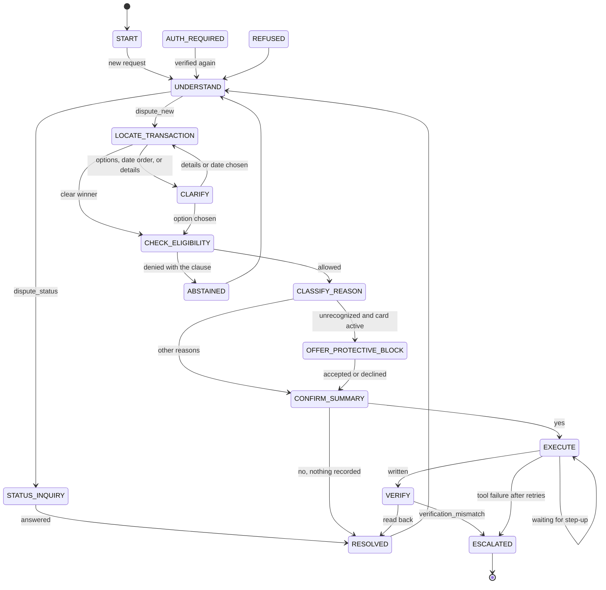
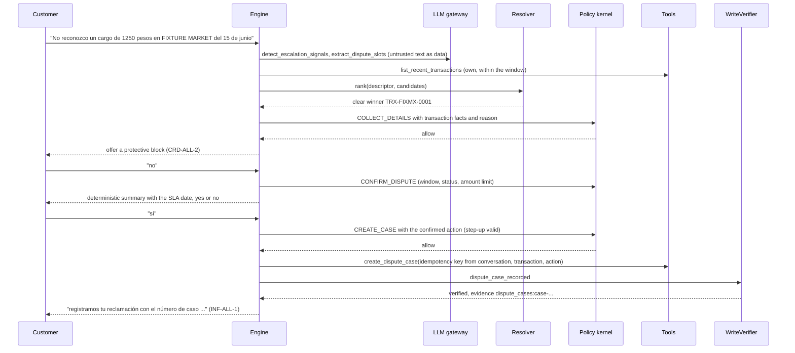
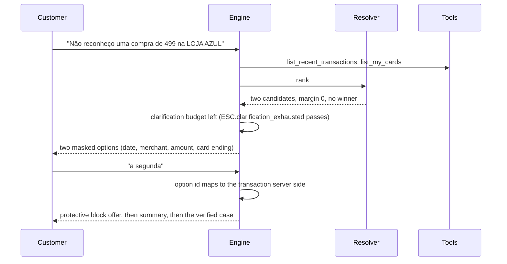
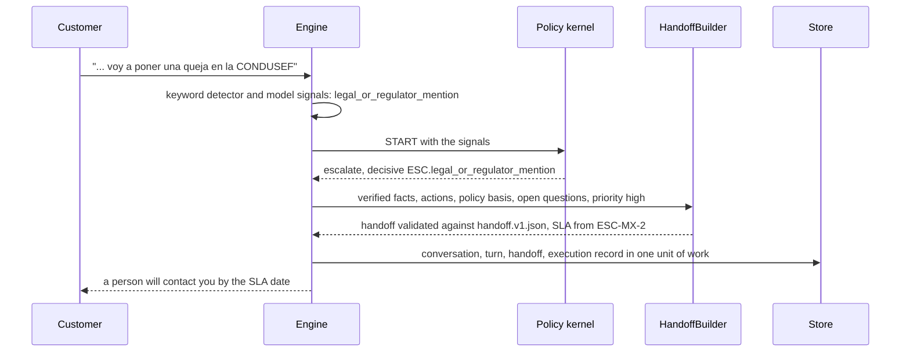

# Dispute intake and status

The `dispute` workflow opens a dispute case for one of the verified customer's own transactions, optionally with a protective card block, and answers questions about existing cases. It is an explicit state machine hosted by the generic engine ([workflow router](workflow-router.md), [ADR 0014](../adr/0014-explicit-state-machine-over-an-agent-framework.md), [ADR 0024](../adr/0024-workflow-registry-with-router-dispatch.md)). Code: `services/api/src/bank_agent/application/workflows/dispute/`. Every clause is synthetic demonstration content.

The language model helps only with understanding (`extract_dispute_slots`, `detect_escalation_signals`); deterministic code normalizes amounts and dates, ranks transactions, asks the kernel, writes, and reads back. A write is reported only after `WriteVerifier` confirms it.

## State machine

Every non-terminal state also exits to ESCALATED, ABSTAINED, REFUSED, and AUTH_REQUIRED (shared exits, added by the definition builder and checked like any other move). A session that expires in CONFIRM_SUMMARY, EXECUTE, or VERIFY resumes at CONFIRM_SUMMARY after re-authentication and asks again.

## States, rules, clauses, tools, and exits

Engine states are evaluated and grounded in the canonical binding states of `policies/bindings.yaml` (the "binding" column). Common clauses on every state: `SCOPE-ALL-1`, `AUTH-ALL-1`, `AUTH-ALL-2`, `PRV-ALL-1`, `PRV-ALL-2`, `ESC-ALL-1`, `ESC-ALL-3`, which bind the AUTH, PRV, SCOPE, and common ESC rules. Before each handler the engine checks the binding's authentication; an elevated risk tier raises it to step-up.

| State | Binding | Ports | Rules beyond the common ones | Clauses beyond the common ones | Tools | Exits |
|---|---|---|---|---|---|---|
| START | START | none | `SCOPE.supported_intent` | SCOPE-ALL-2 | none | UNDERSTAND |
| AUTH_REQUIRED | START | none | AUTH rules at the resume state | SCOPE-ALL-2 | none | the resume state |
| UNDERSTAND | START | IntentRouter, LLM (`extract_dispute_slots`) | none | SCOPE-ALL-2 | none | STATUS_INQUIRY, LOCATE_TRANSACTION |
| STATUS_INQUIRY | ANSWER_CASE_STATUS | none | `DSP.case_within_sla` | DSP-{c}-2, INF-ALL-1 | list_my_cases, get_case_status | RESOLVED, ESCALATED |
| LOCATE_TRANSACTION | LOCATE_TRANSACTION | TransactionResolver (`resolver:rules@1`) | `DSP.transaction_owned_by_session_customer` | DSP-ALL-5 | list_recent_transactions, get_transaction, get_product_status, list_my_cards | CHECK_ELIGIBILITY, CLARIFY |
| CLARIFY | LOCATE_TRANSACTION | TransactionResolver | as above | DSP-ALL-5 | as above | LOCATE_TRANSACTION, CHECK_ELIGIBILITY |
| CHECK_ELIGIBILITY | COLLECT_DETAILS | none | ownership, `DSP.within_window`, `DSP.status_eligible`, `DSP.not_already_disputed`, `DSP.reason_supported`, `DSP.required_fields_present` | DSP-ALL-5, DSP-{c}-1, DSP-ALL-1 to 4 | get_transaction, get_product_status, list_my_cases | CLASSIFY_REASON, ABSTAINED |
| CLASSIFY_REASON | COLLECT_DETAILS | LLM reason candidates | as above | as above | as above | OFFER_PROTECTIVE_BLOCK, CONFIRM_SUMMARY |
| OFFER_PROTECTIVE_BLOCK | OFFER_CARD_BLOCK | none | `CRD.card_owned_by_session_customer`, `CRD.card_active`, `CRD.block_requires_step_up` | CRD-ALL-1, CRD-ALL-2 | as above | CONFIRM_SUMMARY |
| CONFIRM_SUMMARY | CONFIRM_DISPUTE | none | every DSP rule, `DSP.amount_within_auto_limit` | + DSP-{c}-3, DSP-{c}-2 | as above | EXECUTE, RESOLVED |
| EXECUTE | CREATE_CASE (the block: EXECUTE_BLOCK) | none | the rules above with the confirmed action, `SCOPE.action_allowed_in_state`, `AUTH.step_up_valid` | + INF-ALL-1 (block: CRD-ALL-1, CRD-ALL-2, INF-ALL-2) | block_card, create_dispute_case | VERIFY, EXECUTE (step-up) |
| VERIFY | CREATE_CASE, EXECUTE_BLOCK | WriteVerifier | `ESC.verification_mismatch` | as EXECUTE | get_case_status (read-backs are recorded on the write) | RESOLVED, ESCALATED |
| RESOLVED, ABSTAINED, REFUSED | START | IntentRouter | common | SCOPE-ALL-2 | none | UNDERSTAND, switch |
| ESCALATED | ESCALATE | HandoffBuilder | common | ESC-{c}-2 | none | terminal |

`{c}` is the verified customer's country (MX, CO, AR), never text. The dispute window (`DSP-{c}-1`), the resolution SLA (`DSP-{c}-2`), and the automatic intake limit (`DSP-{c}-3`) come from clause parameters.

## Understanding

- Amounts: `lucas`/`luca` and `mil` and `k` multiply by 1,000, `palos`, `millones`, `milhões` by 1,000,000; `varos` and `pesos` are the unit; separators follow the text; a bare `$` takes the account currency. The normalized amount wins over the model's number when the text has a multiplier or a currency marker.
- Dates: `ayer`, `anteayer`, `ontem`, `anteontem`, weekdays with `pasado`/`passado`, `la semana pasada`, `el mes pasado`, `hace N días`, `7 de junio`, full dates, and `dd/mm` against the `Clock` in the customer's time zone. `03/04` keeps both readings; readings in the future or before the window are dropped, and two remaining readings are asked.
- Reason, merchant, card ending, and channel have keyword fallbacks, so the workflow runs with `LLM_PROVIDER=fake` (every model call refused).

## Sequence: normal path (scenario 1, es-MX)

## Sequence: ambiguous path (scenario 3, pt-BR)

## Sequence: escalation path (scenario 6, es-MX)

## Confirmation and abstention matrix

| Situation | Outcome | Basis |
|---|---|---|
| Open a case | Customer's yes at CONFIRM_SUMMARY, step-up at EXECUTE, read-back before success | `policies/matrix.yaml`, `AUTH-ALL-1`, ADR 0010 |
| Protective block during a dispute | Consent at OFFER_PROTECTIVE_BLOCK, the same summary confirmation, step-up, read-back; declining leaves the dispute unchanged | `CRD-ALL-2` |
| Window closed, transaction not approved, already disputed | Abstain with the rendered clause, human offered | `DSP-{c}-1`, `DSP-ALL-1`, `DSP-ALL-4` |
| Pending transaction | Abstain | `DSP-ALL-1` |
| Refund decision, chargeback promise, limit increase, investment | Out-of-scope abstention, human offered | `SCOPE-ALL-1`, `SCOPE-ALL-2` |
| Another customer's record named in the text | Refuse without disclosure, trust event | `PRV-ALL-1` |
| Third-party request | Refuse, trust event | `PRV-ALL-2` |
| Amount above the automatic limit, unsupported reason | Escalate | `DSP-{c}-3`, `DSP-ALL-3` |
| Legal mention, distress, human request, repeat complainer, high risk tier | Escalate | `ESC-ALL-1`, `ESC-ALL-3` |
| Clarification budget spent (2), tool failure after 2 retries, verification mismatch | Escalate | `ESC-ALL-1` |
| Open case past its SLA | Escalate | `DSP-{c}-2` (`DSP.case_within_sla`) |
| Customer declines the summary | Nothing recorded | none |

## Tests

Scenarios 1 to 12 and 19 run on the in-memory adapters and on PostgreSQL through testcontainers (`services/api/tests/integration/workflows/test_dispute_normal.py`, `test_dispute_edges.py`), with scripted models or the refusing client; a Hypothesis property drives every tool outcome through EXECUTE and VERIFY (`test_success_needs_verification.py`).

## Limitations

- The resolver is a rule baseline until phase 10; merchant matching is word overlap, so a merchant the customer names differently than the record ranks lower.
- Merchant extraction without the model reads the words after "en", "na", "em", or "at" only.
- The keyword router misreads phrasing outside its tables; misrouted requests end in a clarifying question or an out-of-scope answer, never an action.
- Portuguese paths run on Mexican, Colombian, and Argentine personas and their currencies (the data has no Brazilian customers).
