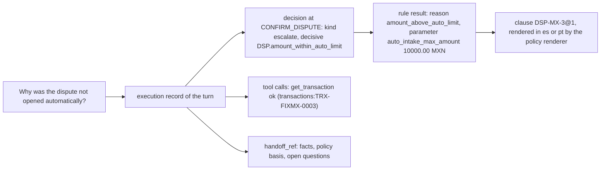

# Execution records

Every turn produces one execution record (`contracts/schemas/execution_record.v1.json`, version 1.2.0; [ADR 0006](../adr/0006-handoff-and-execution-record-contracts.md)). It explains what happened through rules, clauses, records, and outcomes. It has no field for model reasoning, and the engine never asks a model for one: hidden chain-of-thought is not stored, shown, or offered as an audit artifact. Assembly: `services/api/src/bank_agent/application/engine/recorder.py` and `records.py`.

## Where records live

The record is appended in the same unit of work as the conversation update, the turn, and the handoff, so a committed turn always has its record. `execution_records` is append-only at the database level (phase 05 triggers); an identical append for the same turn is a no-op and a different one is refused. Customers read their own records, evaluators read all records, agents none (row-level security and the repository contract). Replaying a turn id returns the stored result from the turn and its record.

## Fields

| Field | What it holds |
|---|---|
| `turn_id`, `conversation_id`, `customer_ref`, `session_ref`, `channel`, `recorded_at` | Identity of the turn |
| `workflow`, `workflow_before` | The definition that handled the turn (`router@1` before dispatch); `workflow_before` only on the turn that switched |
| `state_before`, `state_after`, `outcome` | Engine states and the turn's outcome (`resolved`, `clarified`, `abstained`, `escalated`, `refused`, `in_progress`) |
| `language`, `language_detection` | The language used and the detector's result (`language_detector:lexical@1`) |
| `auth_level`, `risk_tier`, `trust_events_added` | Effective authentication, the lineage's risk tier after the turn, and the trust events this turn appended |
| `intent` | The router's prediction (`router:keyword@1`) with candidates and `below_threshold` |
| `decisions` | Every kernel decision in order: binding state, action, kind, each rule id and version with its reason code and parameters, the decisive rules, clause references, and the pack version |
| `clause_refs` | The ordered union of the decisions' clauses and the clauses the reply cited |
| `tool_calls` | Sequence, tool, arguments after the audit redaction allowlist, idempotency key, status (`ok`, `not_found`, `failed`, `rejected_by_allowlist`), error code, attempts, latency, a result summary code, and the read-back `verification` on writes |
| `llm_calls`, `prompts` | Prompt id and version, model id, tokens, cost, latency, status (`ok`, `repaired`, `fallback` with the error code) |
| `models` | Every model used: router, resolver, language detector, retriever |
| `retrieval` | For informational turns: retriever, decision, threshold, top score, citations (added in 1.2.0) |
| `policy_pack_version` | The pack every decision used |
| `latency`, `token_usage`, `cost_usd` | Total and per stage (`gate`, `workflow`); tokens and cost are the sums over the model calls |
| `grounding` | The template id, whether model phrasing was used, and the verifier's violation kinds |
| `safety_interventions` | Codes such as `injection_detected`, `record_text_injection_flagged`, `session_expired`, `llm_fallback`, `out_of_scope`, `unsupported_<code>` (for example `unsupported_transfer`, `unsupported_decision_now`), `mortgage_information_only`, `risk_estimate_unavailable`, `grounding_violation`, `phrasing_rejected`, `handoff_summary_rejected`, `tool_rejected_by_allowlist` |
| `handoff_ref`, `case_refs` | The handoff of an escalated turn (required), the cases a verified write opened |
| `risk_estimates` | Credit turns: each estimate the engine obtained from the `RiskEstimator` port (model, estimate id, probability, interval, band, flags, label definition, latency). Internal: never shown to customers or sent to a model. Empty when the estimator was unavailable (never a default) |
| `eligibility_assessments` | Credit turns: each assessment of the synthetic eligibility service (`eligibility:synthetic@<pack>`, product, outcome, ELG rule ids and versions, review reasons, missing facts). Kept apart from the estimates: the two are never merged |

## Explaining a decision without chain-of-thought



Each answer to "why" is a chain of facts the system can show: which rule failed, with which parameter from which clause version, over which record, and what was done about it. The first decision recorded for a state is the engine's authentication check, made without record facts, so its non-authentication rules report missing facts; only an authentication denial or step-up from that check is acted on.

## Example: a credit turn (abridged, scenario 27)

The turn that assessed a borderline request. The profile read is a recorded tool call with no values; the estimate and the assessment are separate entries.

```json
{
  "workflow": {"id": "credit", "version": 1},
  "state_before": "START",
  "state_after": "EXPLAIN_ELIGIBILITY",
  "outcome": "in_progress",
  "tool_calls": [
    {"tool": "list_credit_products", "status": "ok", "result_summary": "count_3"},
    {"tool": "get_my_credit_profile", "status": "ok", "arguments": {}, "result_summary": "found"}
  ],
  "models": ["router:keyword@1", "language_detector:lexical@1", "risk_estimator:score_band@1"],
  "risk_estimates": [
    {"model": "risk_estimator:score_band@1", "estimate_id": "rsk-000001", "probability": "0.15",
     "interval_low": "0.08", "interval_high": "0.26", "band": "low", "flags": ["wide_interval"],
     "label_definition": "score_band_baseline_prior", "latency_ms": 0}
  ],
  "eligibility_assessments": [
    {"assessment_id": "elg-000001", "service": "eligibility:synthetic@pack-...", "product_code": "CO-PL-STANDARD",
     "outcome": "review_required", "review_reasons": ["borderline_risk_interval"], "missing_facts": []}
  ],
  "grounding": {"llm_phrasing_used": false, "template_id": "credit.eligibility", "violations": []}
}
```

## Example (abridged)

```json
{
  "schema_version": "1.2.0",
  "workflow": {"id": "dispute", "version": 1},
  "state_before": "OFFER_PROTECTIVE_BLOCK",
  "state_after": "ESCALATED",
  "outcome": "escalated",
  "decisions": [
    {"state": "CONFIRM_DISPUTE", "kind": "escalate", "decisive_rule_ids": ["DSP.amount_within_auto_limit"],
     "clause_refs": ["AUTH-ALL-1@1", "DSP-MX-3@1", "ESC-ALL-1@1"], "policy_pack_version": "pack-5ee486a3be987025"}
  ],
  "tool_calls": [
    {"sequence": 1, "tool": "get_transaction", "arguments": {"transaction_id": "[redacted]"}, "status": "ok", "attempts": 1}
  ],
  "models": ["language_detector:lexical@1"],
  "grounding": {"llm_phrasing_used": false, "template_id": "common.escalated", "violations": []},
  "handoff_ref": "ho-000001"
}
```

## Limitations

- Latency is measured in process with a monotonic timer; the phase 15 tracing adapter adds spans and the trace id.
- Tool arguments outside the audit allowlist are stored as `[redacted]`, so an agent reviewing a record follows the target reference to the record itself.
