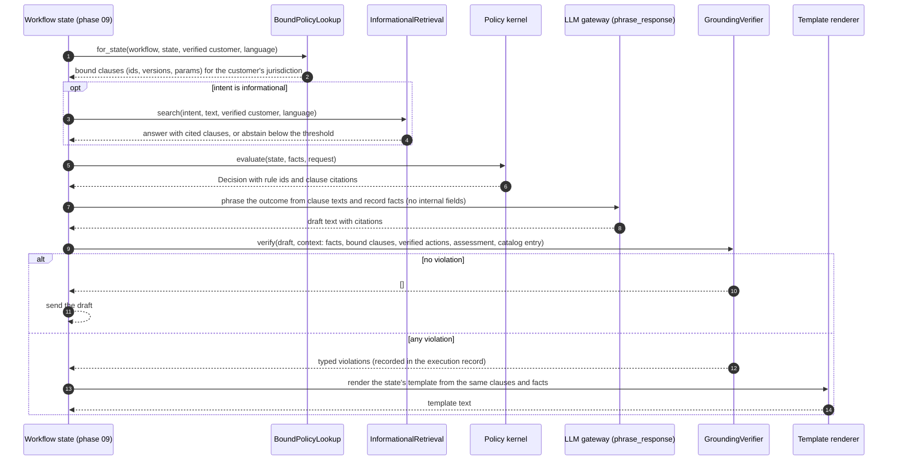

# Grounding: bound policies, informational retrieval, and the verifier

Every factual statement a customer reads is grounded either in records passed in with the draft or in cited policy clauses ([ADR 0012](../adr/0012-bound-policies-and-informational-retrieval.md)). Workflow states fetch their governing clauses deterministically by id; open retrieval serves only informational questions and abstains below a measured threshold; a deterministic verifier checks every draft, and any violation sends the workflow to its template. Phase 09 wires these into the state machines; this page describes the components phase 07 built (`bank_agent/application/grounding`, `bank_agent/adapters/retrieval`).

## A turn end to end

The same sequence applies when the model is unavailable: the workflow renders the template directly, which the verifier also checks in tests (every bound explanation and every eligibility answer of the pack passes it in every state, country, and language).

## Bound lookup

`BoundPolicyLookup(repository)` resolves, at construction, the clauses of every state in `WorkflowDescriptor.states` for every country and language: a missing binding or clause is a startup error (`PolicyBindingMissingError`), and the pack loader already rejects bindings that miss a registered state or name an unknown one. At runtime `for_state(workflow, state, customer, language)` takes the verified `Customer` record, so the jurisdiction can only come from the verified profile. The result, `BoundPolicy`, carries the clauses in binding order (the `common` clauses first, `{country}` resolved), their references, and their parameters, with the pack version.

## Which intents may use open retrieval

| Intent | Workflow | Open retrieval | Source of the answer |
|---|---|---|---|
| `informational` | any of the four, or none yet | yes, with abstention | Retrieved clauses of the customer's jurisdiction and language (ELG never) |
| `balance_inquiry`, `payment_status`, `statement_request` | `account_inquiry` | no | Record facts with their as-of date, and the bound ACC clauses |
| `card_status`, `card_block`, `card_unblock_request`, `card_replacement_request` | `card_support` | no | Record facts, verified action results, and the bound CRD and INF clauses |
| `dispute_new`, `dispute_status` | `dispute` | no | Record facts, verified action results, and the bound DSP and INF clauses |
| `credit_product_info` | `credit` | no | The synthetic catalog entry for the verified jurisdiction and the bound CRE clauses |
| `credit_eligibility`, `credit_application`, `credit_application_status` | `credit` | no | The synthetic eligibility service's assessment (never retrieved text), the catalog, and the bound CRE, ELG, ESC, and INF clauses |
| `unsupported`, `human_request`, `greeting_or_other` | any | no | Bound SCOPE and ESC clauses (clarify, abstain, or hand off) |

Calling `InformationalRetrieval.search` with any other intent raises `RetrievalNotAllowedError`, a programming error.

## Open retrieval

- **Corpus.** Every current clause of the pack in es, pt, and en, rendered with its own parameters in its locale (so `90 días` is searchable), except the ELG family: eligibility rules never come from retrieved text. Each retriever filters by language and jurisdiction (the customer's, or `ALL`) before scoring.
- **Retrievers.** `Bm25Retriever` (Okapi BM25 with accent folding, per-language stopwords, and six-character truncation stemming), `DenseRetriever` (`intfloat/multilingual-e5-small` through the optional `ml` extra, embeddings cached on disk by content hash), and `HybridRetriever` (reciprocal rank fusion, k = 60, after each component's floor). The API uses BM25 by default because its image has no `ml` extra; `RETRIEVAL_RETRIEVER` switches without workflow changes.
- **Abstention.** `RetrievalPolicy` keeps hits at or above the retriever's threshold (tuned on the dev split of the judgments: BM25 3.6292, dense cosine 0.8275) and abstains otherwise; it also drops any ELG hit. The hybrid retriever abstains when no component hit clears its floor. Results are in [the retrieval evaluation](../evaluation/retrieval.md).
- **Index.** `bank-agent index build` (`make index`, `DENSE=1` for embeddings) writes `data/artifacts/retrieval/indexes/<pack version>/`. With `RETRIEVAL_INDEX_SOURCE=stored` (required in production) the API loads the index of the current pack version and refuses a mismatch; with `build` (development) it builds the BM25 index from the loaded pack at startup.

## The grounding verifier

`GroundingVerifier(repository).verify(draft, context)` returns typed violations and never rewrites the draft.

| Check | Violation kinds |
|---|---|
| Every cited clause (structured or inline, such as `[DSP-MX-1@1]`) exists, is the current version, and belongs to the customer's jurisdiction | `unknown_clause`, `stale_clause_version`, `clause_outside_jurisdiction` |
| Every amount, date, time, duration, percentage, masked number, and plain number matches a parameter of a cited or bound clause, a record fact, or the catalog entry; units must agree (`90 días` against `dispute_window_days`) | `unsupported_amount`, `unsupported_duration`, `unsupported_date`, `unsupported_number`, `unsupported_reference` |
| Number and date formats in es, pt, and en: `1.250.000,00`, `1,250,000.00`, an ambiguous `1.250` read both ways, `60 días` and `60 dias`, `días hábiles` and `dias úteis`, month names in the three languages | (normalization) |
| A bare `$` or `pesos` resolves to the account currency; any other currency marker must agree with it or with the record | `currency_conflict`, `currency_unresolved` |
| An action stated as done ("bloqueamos tu tarjeta", "a contestação foi registrada") needs a verified `ActionResult` of that kind; actions no tool performs are never claimed | `unverified_action_claim`, `unsupported_action_claim` |
| Balances and statement totals match their own facts, and every balance statement carries the as-of date of its data | `balance_mismatch`, `statement_total_mismatch`, `balance_without_as_of` |
| Catalog rates, amounts, and terms match the synthetic catalog entry of the verified jurisdiction | `rate_not_in_catalog`, `catalog_figure_mismatch`, `catalog_jurisdiction_mismatch` |
| An eligibility statement needs an `EligibilityAssessment`, with the same outcome | `eligibility_without_assessment`, `eligibility_outcome_mismatch` |
| Credit responses contain no approval wording in es, pt, or en, even negated (the `policy.lexicon` stems) | `approval_wording` |
| No credit score, income, or risk estimate figure appears, and no figure stands next to a score, income, or risk term unless it is a cited clause parameter | `internal_figure_disclosed` |

A sentence that repeats a whole sentence of a cited or bound clause is quoted policy, not a claim about the conversation, so the action and eligibility lexicons skip it; a fragment of such a sentence is still checked.

## Limitations

- The verifier is lexical and closed: numbers written as words ("sesenta días") and paraphrased claims outside its lexicons are not detected. The template fallback and the evaluation harness (phase 14) cover what it misses.
- The judgments are team-written and pending review; per-workflow test cells hold 12 in-scope queries, so the retriever choice and the thresholds are provisional.
- Only the informational intent retrieves; a question that mixes an informational part with a workflow request is split by the router (phase 10) or clarified.
