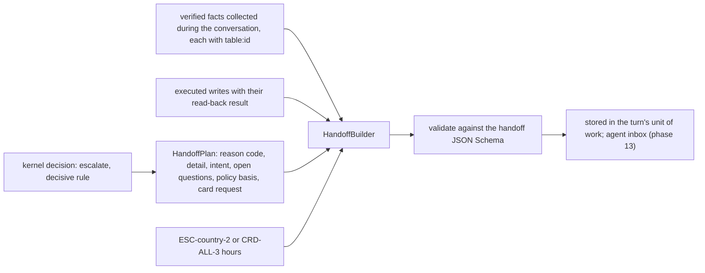

# Handoffs

When a conversation needs a person, the engine builds a structured handoff (`contracts/schemas/handoff.v1.json`, version 1.2.0; [ADR 0006](../adr/0006-handoff-and-execution-record-contracts.md)). It carries what the agent needs to continue without asking the customer to repeat anything, and never the transcript. Builder: `services/api/src/bank_agent/application/engine/handoff.py`.

## How a handoff is built



## Field walkthrough

| Field | Source | Notes |
|---|---|---|
| `handoff_id`, `created_at` | `IdGenerator`, `Clock` | |
| `conversation_ref`, `customer_ref` | The conversation and the verified session | Internal ids only; no name, document, or contact detail |
| `state_at_escalation`, `workflow` | The engine state and definition | |
| `language`, `jurisdiction` | Session language (es or pt), verified country | |
| `auth` | The session snapshot | Level and absolute expiry |
| `request` | Deterministic one-paragraph summary and the served intent | At most 500 characters; model summaries are off by default (`WORKFLOW_LLM_HANDOFF_SUMMARY`) |
| `verified_facts` | Facts the workflow read from records (a transaction, a card, a case, a verified write) | At most 20, each with a `table:id` source |
| `actions_taken` | Executed writes with status and verification (`verified`, `not_verified`, `mismatch`) | A write is `verified` only with read-back evidence |
| `policy_basis` | The decisive rules' clauses plus the SLA clause | `clause_id@version` |
| `escalation_reason` | Code from the decisive rule (for example `ESC.legal_or_regulator_mention` gives `legal_or_regulator_mention`), detail = the rule ids | Fixed code list |
| `open_questions` | The workflow's unresolved slots ("Which transaction does the customer dispute?", "Which card does the customer mean?") | Whichever step escalated |
| `priority`, `customer_sentiment` | `high` for distress, a legal mention, or a high risk tier; otherwise `medium` | |
| `sla_due` | `ESC-<country>-2`: `priority_handoff_sla_hours` for distress, else `handoff_sla_hours`; `CRD-ALL-3` for card requests | Synthetic values |
| `card_request` | Unblock or replacement requests | Required by the model for those codes |
| `credit_review` | Credit handoffs (`credit_review_required`, `eligibility_contested`, and a review requested after `not_eligible`) | The product, the outcome, the ELG rule ids, the failing reason codes, the review reasons, the missing facts, and `risk` (band, interval, model, label): internal, for agents only, derived again deterministically at escalation time |

Unknown keys are rejected at every level of the model and the schema, which is how transcript fields are refused. The engine validates every handoff against the schema generated from the model (the same generation `make contracts` writes; a test compares it with the committed file) before storing it.

## Worked example: dispute (amount above the automatic limit, es-MX)

The customer disputes a 15,000.00 MXN purchase; `DSP.amount_within_auto_limit` escalates at the confirmation step (`DSP-MX-3` sets 10,000.00 MXN).

```json
{
  "schema_version": "1.2.0",
  "state_at_escalation": "CONFIRM_SUMMARY",
  "language": "es",
  "jurisdiction": "MX",
  "customer_ref": "CLI-FIXMX0001",
  "request": {
    "summary": "Customer request (dispute_new) in workflow dispute, state CONFIRM_SUMMARY. Escalated: amount_above_auto_limit. Verified facts: 1; actions: 0.",
    "intent": "dispute_new"
  },
  "verified_facts": [
    {"fact": "transaction of 15000.00 MXN on 2026-06-12 with status approved", "source": "transactions:TRX-FIXMX-0003"}
  ],
  "actions_taken": [],
  "policy_basis": ["DSP-MX-3@1", "ESC-MX-2@1"],
  "escalation_reason": {"code": "amount_above_auto_limit", "detail": "DSP.amount_within_auto_limit"},
  "priority": "medium",
  "sla_due": "2026-06-19T15:00:00Z",
  "workflow": {"id": "dispute", "version": 1}
}
```

## Worked example: card support (unblock request, es-MX)

```json
{
  "schema_version": "1.2.0",
  "state_at_escalation": "SELECT_CARD",
  "request": {"summary": "Customer request (card_unblock_request) in workflow card_support, state SELECT_CARD. Escalated: card_unblock_requested. Verified facts: 1; actions: 0.", "intent": "card_unblock_request"},
  "verified_facts": [{"fact": "card ending 5678 (debit_card) is blocked", "source": "products:PRD-FIXMX-DEB"}],
  "policy_basis": ["CRD-ALL-3@1"],
  "escalation_reason": {"code": "card_unblock_requested", "detail": "CRD.unblock_requires_human"},
  "card_request": {"action": "unblock_request", "product_ref": "products:PRD-FIXMX-DEB"},
  "sla_due": "2026-06-19T15:00:00Z"
}
```

Other card handoffs: a stolen-card replacement after an accepted protective block lists the block in `actions_taken` with `verification: verified` and evidence `products:<id>` (scenario 16).

## Worked example: account inquiry (contested balance, es-CO)

The customer insists a balance is wrong (scenario 23). The balance and its as-of date are the verified fact; nothing is written.

```json
{
  "schema_version": "1.2.0",
  "state_at_escalation": "BALANCES",
  "language": "es",
  "jurisdiction": "CO",
  "request": {"summary": "Customer request (balance_inquiry) in workflow account_inquiry, state BALANCES. Escalated: unsupported_needs_human. Verified facts: 1; actions: 0.", "intent": "balance_inquiry"},
  "verified_facts": [{"fact": "checking_account ending 3333 balance 3450000.00 COP as of 2026-06-17", "source": "products:PRD-FIXCO-CHK"}],
  "actions_taken": [],
  "policy_basis": ["ACC-ALL-1@1", "ESC-CO-2@1"],
  "escalation_reason": {"code": "unsupported_needs_human", "detail": "balance_contested"},
  "open_questions": ["Which balance does the customer consider wrong, and why?"],
  "priority": "medium",
  "sla_due": "2026-06-19T15:00:00Z",
  "workflow": {"id": "account_inquiry", "version": 1}
}
```

## Worked example: credit (borderline estimate, pt-BR)

The synthetic service returns `review_required` because the estimate's interval straddles a cut point (scenario 27); the customer accepts the review. The estimate is in `credit_review.risk` for the reviewer; the customer never saw it.

```json
{
  "schema_version": "1.2.0",
  "state_at_escalation": "EXPLAIN_ELIGIBILITY",
  "language": "pt",
  "jurisdiction": "CO",
  "request": {"summary": "Customer request (credit_eligibility) in workflow credit, state EXPLAIN_ELIGIBILITY. Escalated: credit_review_required. Verified facts: 1; actions: 0.", "intent": "credit_eligibility"},
  "verified_facts": [{"fact": "synthetic eligibility assessment for CO-PL-STANDARD: review_required", "source": "eligibility_assessments:elg-000001"}],
  "policy_basis": ["ESC-ALL-4@1", "ESC-CO-2@1"],
  "escalation_reason": {"code": "credit_review_required", "detail": "credit_review_required: review_required"},
  "open_questions": ["What does the credit team conclude after reviewing the flagged request?"],
  "workflow": {"id": "credit", "version": 1},
  "credit_review": {
    "product_code": "CO-PL-STANDARD",
    "eligibility_outcome": "review_required",
    "rule_ids": ["ELG.self_service_product", "ELG.credit_score_present", "ELG.credit_score_minimum", "ELG.income_present", "ELG.payment_to_income_max", "ELG.days_past_due_max", "ELG.tenure_minimum", "ELG.amount_within_product_range", "ELG.risk_estimate_available", "ELG.risk_band_acceptable", "ELG.risk_interval_not_borderline"],
    "reason_codes": ["borderline_risk_interval"],
    "review_reasons": ["borderline_risk_interval"],
    "missing_facts": [],
    "risk": {"band": "low", "interval_low": "0.08", "interval_high": "0.26", "model": "risk_estimator:score_band@1", "label_definition": "score_band_baseline_prior"}
  }
}
```

A missing-income case (scenario 26) carries `eligibility_outcome: insufficient_data`, `missing_facts: ["monthly_income"]`, and `review_reasons: ["missing_income"]`; a contested result carries `eligibility_contested` and adds `customer_contests_result` to the review reasons.

## What agents see

The agent inbox (phase 13) shows the handoff as stored: the summary, the facts with links to their records, the actions and whether each was verified, the policy basis rendered from the clauses, the open questions, the SLA, the card request, and the credit review with the internal estimate (agents only; customer response models never carry it). Agents do not see the conversation transcript through the handoff; turns stay in the conversation store for the customer's own history.

## Limitations

- The summary is deterministic and terse; the optional model summary (off by default) must cite only supplied fact ids and pass the grounding verifier, and is not yet evaluated.
- Handoff SLAs are synthetic clause parameters.
