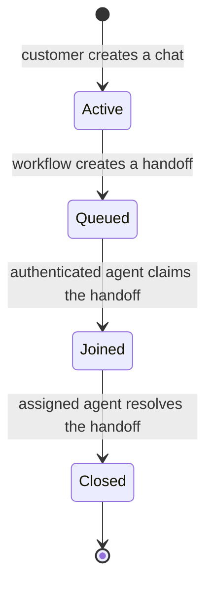

# Live human service in the existing conversation

[ADR 0026](../adr/0026-live-agent-joins-escalated-conversation.md) keeps one conversation ID from the assistant exchange through the human handoff and its closure. The structured handoff remains the agent's context; the human exchange has its own persisted messages, separate from assistant turns and model summaries.

## Lifecycle and delivery

The customer can leave follow-up messages while queued. A created handoff means waiting, not a connected agent. Claiming the handoff records the assigned staff identity and join time; only that agent can read or reply to the human exchange. Resolution records its outcome and timestamp and closes the same conversation atomically. Closed history remains readable until the conversation-text retention period expires; new sends fail with 409. Replaying an already accepted message ID returns its original receipt, including after closure.

Customer follow-ups go through the human-message service instead of the assistant engine. Human messages never invoke banking tools. The agent sees the structured request, verified facts, actions, evidence, and open questions alongside the human exchange; the channel grants no access to earlier assistant transcripts or credit profiles.

The web client polls while queued or joined, in pages of up to 100 messages using a sequence cursor. Refresh and reconnection reload persisted messages, deduplicate by message ID, and keep the existing conversation URL. A failed transport shows a disconnected notice separately from the persisted queued/joined/closed state; it does not change assignment. Closed channels stop polling. This implementation is polling delivery, not a WebSocket transport or an agent-presence heartbeat.

## API and identity

| Caller         | Read                                                    | Send                                                              |
| -------------- | ------------------------------------------------------- | ----------------------------------------------------------------- |
| Customer       | `GET /v1/conversations/{conversation_id}/human-service` | `POST /v1/conversations/{conversation_id}/human-service/messages` |
| Assigned agent | `GET /v1/agent/handoffs/{handoff_id}/human-service`     | `POST /v1/agent/handoffs/{handoff_id}/human-service/messages`     |

GET accepts `after` (the last sequence received). POST accepts only a UUID `message_id` and trimmed text of 1 to 4,000 characters. Author identity and role come from the trusted session. Writes require CSRF and the WRITE request rate class. Unowned conversations and unassigned channels return 404. Evaluators cannot use either channel. Customer responses contain message roles and lifecycle timestamps, without staff identifiers or internal credit fields. Audit events record message and conversation IDs without copying text.

Migration `0014_human_service_messages.py` creates `app.human_messages`, with forced RLS, claim-scoped staff reads, authorized inserts, append-only guards, and only SELECT/INSERT grants for the application role. The legacy `app.messages` table stays intact: its mixed assistant/mock roles are not the real-human authority boundary. New messages reference both the handoff and the existing conversation. Handoff claim, send, and close share a transaction advisory lock; competing operations conflict and can be retried. A narrowly scoped owner trigger closes the conversation without granting agents transcript access.

## Creating another chat

The server permits at most five successful new conversations per authenticated customer in the preceding rolling 60 minutes. Counting is customer-scoped across sessions and API workers, serialized transactionally, and excludes rolled-back creations. At exactly 60 minutes an old creation leaves the window. A refused creation returns 429 `conversation-creation-limited` with `Retry-After`. Existing messages consume no creation slots, and multiple active chats are allowed.

## Verification and local walkthrough

1. Run `make db-upgrade` on an existing database, then start API and web as in the repository README. Use separate browser sessions for a customer persona and `agent-demo-01`.
2. In the customer chat, request a person. Confirm the queued state and leave a follow-up. The URL retains its conversation ID.
3. In the agent inbox, claim that handoff, read its structured context, and send a reply. Both browsers show the exchange on the original conversation.
4. Refresh both browsers. Temporarily disconnect the customer browser, then reconnect; the saved exchange returns. Resolve from the assigned agent and check that the customer history stays readable and the composer closes.
5. Start another chat; the sixth creation within an hour is refused, including from another session for the same customer.

Automated evidence: shared repository contracts cover both memory and PostgreSQL, including isolation, idempotency, rollback, creation boundaries, and lifecycle races. HTTP integration tests exercise both directions with customer and agent logins, queued availability, refresh reads, closure, CSRF, rejected forged authors, and creation quotas across sessions. Web integration tests cover queued sends, refresh, reconnect, cursor pagination, claim and reply, the quota message, and accessibility in both themes. Production-role tests exercise forced RLS, closure, and retention with a non-superuser owner. Historical evaluation results describe the frozen assistant run and are not measurements of this new capability.
