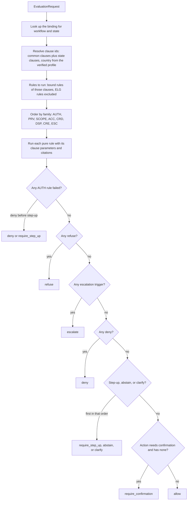
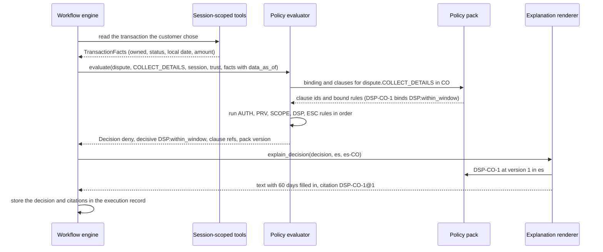

# Policy evaluation

How the deterministic kernel (`services/api/src/bank_agent/policy/`) turns a workflow state and its facts into a `Decision`, and how a decision is explained. The design is recorded in [ADR 0011](../adr/0011-policy-as-data-and-pure-rule-functions.md); the clauses, rules, and bindings are listed in the generated [policy catalog](../policy/catalog.md); the synthetic eligibility service is described in [eligibility.md](../policy/eligibility.md). Every clause is synthetic demonstration content.

## Inputs

`evaluate(request, pack)` receives an `EvaluationRequest`:

| Field | Source (phase 09) | Notes |
|---|---|---|
| `workflow`, `state` | The workflow engine | State names come from `policies/bindings.yaml`; an unknown state raises `PolicyBindingMissingError` |
| `action` | The engine, when it proposes a write | `confirmed_at` is set only after the customer's explicit confirmation |
| `session` | `Session.snapshot(now)` | Effective authentication level, step-up window, expiry |
| `trust` | The session lineage's `TrustState` | Its risk tier never decreases (ADR 0005) |
| `facts.jurisdiction` | The verified customer profile | Never from user text |
| `facts.data_as_of` | `POLICY_DATA_AS_OF` (default 2026-06-17) | Every time window counts to this date, never to the wall clock |
| Record facts (`account`, `card`, `dispute`, `credit`) | Session-scoped tools | Optional; a missing fact fails its rule safely |
| Signals (`escalation`, `privacy`) | Detectors in the engine | Default to "not detected"; the kernel never parses text |

## Evaluation order and precedence

- **Authentication first.** Insufficient authentication always gives `deny` or `require_step_up`, whatever the other facts (a Hypothesis property). The required level is the highest of the state's level, the action's level, and, at an elevated risk tier, `step_up` (`AUTH-ALL-1`); a higher tier can only raise it.
- **Escalation dominates.** Any trigger (human requested, legal or regulator mention, distress, clarification budget exhausted, tool failure after retries, verification mismatch, repeat complainer, high risk tier, credit review, contested eligibility, unblock or replacement request, dispute amount above the automatic limit, a reason that needs a human) prevents automatic resolution (a Hypothesis property). It outranks a policy denial, so a customer who asks for a person gets one even when the dispute window is closed; the handoff carries the denial as a fact.
- **Refusal outranks escalation.** A cross-customer reference, a third-party request, or a record the session does not own is refused without disclosure.
- **Deny overrides allow.** A rule failure never lets an action through.

## A decision, end to end

## Explanations

`explain_decision` renders the clauses of the decisive rules (or, for `allow` and `require_confirmation`, the workflow-family clauses of the rules that ran) at their exact versions, in the session language. Amounts use the locale's separators and the ISO code (`2.000.000,00 COP` in es-CO and pt-BR, `10,000.00 MXN` in es-MX and en-US). No language model is involved; phase 09 may pass the rendered text to `phrase_response` as grounding, never the reverse.

## What each workflow binds

| Workflow | States (canonical names for phase 09) | Families bound beyond the common SCOPE, AUTH, PRV, ESC |
|---|---|---|
| `account_inquiry` | `START`, `IDENTIFY_PRODUCT`, `ANSWER_BALANCE`, `ANSWER_PAYMENT_STATUS`, `ANSWER_STATEMENT`, `ESCALATE` | ACC |
| `card_support` | `START`, `IDENTIFY_CARD`, `ANSWER_CARD_STATUS`, `CONFIRM_BLOCK`, `EXECUTE_BLOCK`, `CARD_REQUEST_HANDOFF`, `ESCALATE` | CRD, INF |
| `dispute` | `START`, `LOCATE_TRANSACTION`, `COLLECT_DETAILS`, `CONFIRM_DISPUTE`, `CREATE_CASE`, `OFFER_CARD_BLOCK`, `EXECUTE_BLOCK`, `ANSWER_CASE_STATUS`, `ESCALATE` | DSP, CRD, INF |
| `credit` | `START`, `LIST_PRODUCTS`, `PRODUCT_DETAIL`, `COLLECT_APPLICATION`, `PRESENT_ELIGIBILITY`, `CONFIRM_APPLICATION`, `SUBMIT_APPLICATION`, `ANSWER_APPLICATION_STATUS`, `ESCALATE` | CRE, ELG (explanations only), ESC-ALL-4, INF |

The per-state clause lists and required authentication are in the [policy catalog](../policy/catalog.md#bindings). Every write needs confirmation and step-up (`policies/matrix.yaml`, CLAUDE.md section 7), and is allowed only in the states listed there for its workflow.

## Limitations

- The kernel is only as correct as the facts it is given: phase 09 must build them from verified records and detectors, and must pass the data as-of date.
- Detector quality (distress, legal mention, third-party requests) is outside the kernel; a missed signal is a missed escalation.
- The pack is synthetic and awaits the team's bilingual review; values are plausible, not real regulation.
