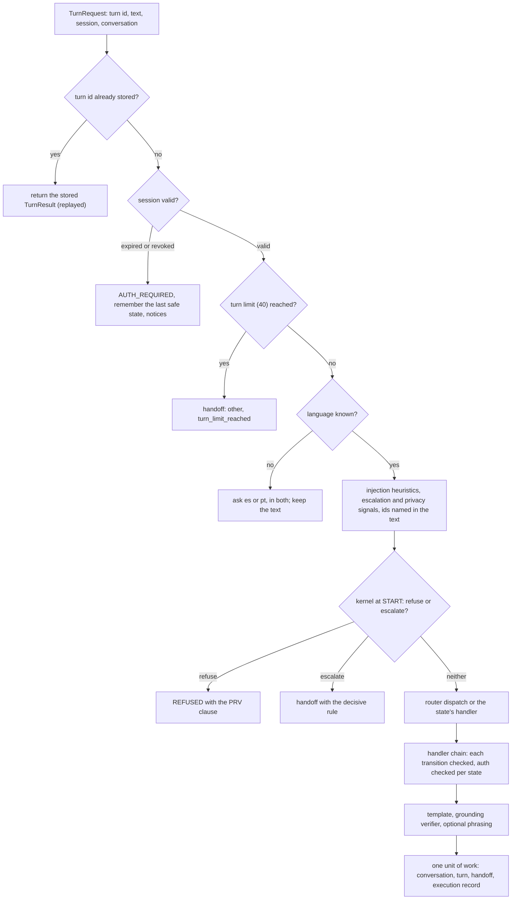

# Workflow router and engine

One generic engine hosts every workflow through a validated registry ([ADR 0024](../adr/0024-workflow-registry-with-router-dispatch.md)); workflows are explicit state machines ([ADR 0014](../adr/0014-explicit-state-machine-over-an-agent-framework.md)). Code: `services/api/src/bank_agent/application/engine/`. Session 09a enables `dispute` ([dispute intake](dispute-intake.md)) and `card_support` ([card support](card-support.md)); session 09b adds `account_inquiry` and `credit` as definitions only.

## One turn

## Dispatch rules

| Router result | Current position | Route |
|---|---|---|
| Below the threshold (0.6) | any | one question offering the two most likely enabled workflows; counts against the clarification budget |
| `informational` | any | open retrieval (BM25, threshold 3.6292): the cited clauses, or a clause-backed abstention; the retrieval record is stored |
| `human_request` | any | handoff, `human_requested` |
| `greeting_or_other` (matched) | any | what the assistant can do, from the enabled workflows |
| `unsupported`, unowned, or owned by a workflow that is not enabled | any | out of scope: `SCOPE-ALL-1` and `SCOPE-ALL-2`, human offered; the kernel sees intent `unsupported` |
| Owned by the current workflow | that workflow | continue |
| Owned by an enabled workflow | router position (no workflow yet) | start it at its entry state |
| Owned by another enabled workflow | a state that is done (RESOLVED, ABSTAINED, REFUSED) | switch |
| Owned by another enabled workflow | mid-flow (an awaited answer, a confirmation, an execution, or CARD_STATUS holding a card) | ask whether to switch; yes switches, no resumes the pending step |

- The router runs where a state accepts a request. In a state awaiting an answer, the handler parses first; only an unparsed answer goes to the router, where a switch is confirmed, a human request escalates, and a shared answer (out of scope, informational) is given without leaving the pending step.
- A switch records `workflow_before` in that turn's execution record and starts the target at its entry state with only verified facts carried over (and, from `card_support` to `dispute`, the chosen card as a candidate filter). An executed action is always verified in the turn it runs, so no switch can interrupt a verification.
- Before any workflow is chosen the conversation sits at the pseudo position `router@1`; its decisions are evaluated at the first enabled workflow's `START` binding (every `START` binding is the same). Moving from there is dispatch, not a switch.

## Registry and the enabled set

`WORKFLOW_ENABLED` (default `dispute,card_support`) lists the enabled workflows. At startup `build_registry` checks, for the proposed system and for baseline B0: every enabled workflow has a definition; each definition's intents equal the catalog's; every state's binding state is canonical and bound for every country and language; no allowlist names the engine-only credit profile read; every write tool sits in a state whose binding the policy matrix allows for that action. Any problem is a `WorkflowRegistryError` and the process does not start. Removing a workflow from `WORKFLOW_ENABLED` sends its intents to the out-of-scope answer, which is how the cut rule of CLAUDE.md section 1 is applied without code changes.

## Guarantees

| Guarantee | Mechanism |
|---|---|
| Idempotent turns | The turn id is the key: a stored turn is replayed; a concurrent duplicate fails `append_turn` and is replayed |
| Clarification budget of 2 | `ESC.clarification_exhausted` over `WorkflowPosition.clarifications_used` (`ESC-ALL-1`) |
| Maximum turns | 40 per conversation, then a handoff |
| Expired session mid-flow | Nothing privileged runs; AUTH_REQUIRED remembers the last safe state (the confirmation for a pending write); after re-authentication the question is asked again; writes are idempotent by a key derived from the conversation, the target, and the action, and executed writes are kept in the conversation data |
| Authentication | Before each handler the kernel checks the binding's level; an elevated risk tier raises it to step-up |
| Tools | Only the state's allowlist; anything else is recorded as `rejected_by_allowlist` and escalates |
| Language | Detected per turn (`language_detector:lexical@1`); the preference sticks unless a message of three or more words is clearly in the other language; English or uncertain text with no preference gets the question in es and pt |

## Baseline B0

B0 runs on the same engine with its own registry (`baseline_b0`): a fixed Spanish menu (with one fixed Portuguese line) instead of the greeting and the workflow question, the menu router (`router:menu@1`, then the keyword router), no language model, the rule resolver's winner or a numbered list, a fixed reason menu, no protective block offer, and otherwise the proposed system's eligibility, confirmation, execution, read-back, and handoff code. The container exposes it as `workflows.engine("baseline_b0")` for phase 14. Baseline B1 (the naive agent) lives in `evals/` and is never wired into the API.

## Limitations

- The keyword router (`router:keyword@1`) is a baseline until phase 10; its tables cover the phrasings in the tests and the scenario set, not every paraphrase.
- The lexical language detector needs marker words; very short texts fall back to the stored preference.
- The informational threshold was tuned on provisional relevance judgments (`docs/evaluation/retrieval.md`).
