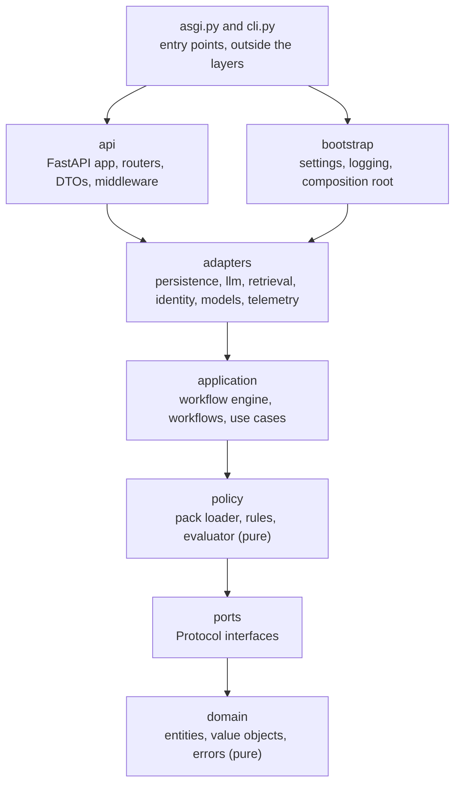

# bank-agent: API service

## Responsibility

`bank-agent` is the banking customer-service backend. The language model understands, deterministic code decides, and evidence proves it. The package holds the domain model, the ports, the policy kernel, the workflow engine, the adapters, and the FastAPI application, arranged as a hexagonal architecture.

## Layers

Imports flow inward only. import-linter enforces the contracts in the root `pyproject.toml`, and `make check` fails on any violation.



An arrow means "may import". A layer may import any layer below it, not only the next one.

| Package | Responsibility | README |
|---|---|---|
| `domain` | Entities, value objects, enums, typed domain errors; no I/O | [domain](src/bank_agent/domain/README.md) |
| `ports` | Protocol interfaces for repositories, models, clocks, and checks | [ports](src/bank_agent/ports/README.md) |
| `policy` | Pure rules registered by id, the evaluator, the policy pack loader | [policy](src/bank_agent/policy/README.md) |
| `application` | Workflow engine, workflows, use cases | [application](src/bank_agent/application/README.md) |
| `adapters` | Implementations of the ports | [adapters](src/bank_agent/adapters/README.md) |
| `api` | FastAPI app factory, routers, middleware, problem details | [api](src/bank_agent/api/README.md) |
| `bootstrap` | Settings, logging, and the composition root | [bootstrap](src/bank_agent/bootstrap/README.md) |
| `prompts` | Versioned prompt files | [prompts](src/bank_agent/prompts/README.md) |

Three contracts apply:

1. **Layers:** `api | bootstrap` over `adapters` over `application` over `policy` over `ports` over `domain`. The `|` makes `api` and `bootstrap` independent: neither imports the other.
2. **Pure core:** `domain`, `ports`, and `policy` never import `fastapi`, `sqlalchemy`, `httpx`, `boto3`, or `litellm`.
3. **Entry points:** no layer imports `bank_agent.asgi` or `bank_agent.cli`.

## Entry points

Because `api` and `bootstrap` cannot import each other, the wiring lives in two package-root modules outside every layer:

- `bank_agent.asgi:create_app` is the uvicorn factory. It loads settings, configures logging, builds the container, and passes it to `bank_agent.api.app.create_app`.
- `bank_agent.cli:app` is the `bank-agent` typer command.

The API layer declares what it needs as the `ServiceProvider` Protocol in `api/provider.py`. The composition root, `bootstrap/container.py`, satisfies it structurally. It is the only module that constructs concrete adapters.

## Public interfaces

- HTTP: `GET /health/live` and `GET /health/ready`. Errors are RFC 9457 problem details (`application/problem+json`). Every response carries `X-Request-ID`.
- CLI: `bank-agent version` and `bank-agent --help`. Phase 07 adds `bank-agent index build`.
- Configuration: environment variables documented in the root `.env.example`, read only by `bootstrap/settings.py`.

Run the API locally:

```bash
uv run uvicorn bank_agent.asgi:create_app --factory --reload
# or, in containers with PostgreSQL:
make up PROFILES=api
```

## Dependencies and extras

Runtime dependencies are declared in `pyproject.toml` and pinned in the root `uv.lock`. The optional `ml` extra, which holds sentence-transformers for the dense retriever, is added in phase 07 and is never installed in the API runtime image.

## How to extend

- **Add an adapter:** implement the Protocol from `ports/` under `adapters/<area>/<technology>/`, add it to the shared contract suite in `tests/contracts/`, and select it in `bootstrap/container.py` from settings.
- **Add cross-cutting behavior:** wrap a port with a decorator that implements the same Protocol (retry, timeout, tracing, redaction) and stack it in the container. Never put it inside business code.
- **Add a setting:** add a field to the matching class in `bootstrap/settings.py`, document the variable in `.env.example`, and add a production rule if it is a secret.
- **Add an endpoint:** add a router under `api/routers/`, include it in `api/app.py`, and register any new error type in `api/problems.py`.
- **Add a rule or a prompt:** see the `policy` and `prompts` READMEs.

## How to test

```bash
uv run pytest services/api/tests -m unit          # no network, no database
uv run pytest services/api/tests -m integration   # PostgreSQL through testcontainers (Docker required)
make check                                        # everything, with coverage gates
```

- `tests/unit/` uses fakes and the httpx ASGI transport; pytest-socket blocks the network.
- `tests/integration/` starts a throwaway `postgres:16.15-alpine3.24` container with the repository init script and credentials generated at runtime. It never reads `.env`.
- Coverage gates: 90% for `domain`, `ports`, `policy`, and `application`; 80% for `adapters`, `api`, and `bootstrap`.
